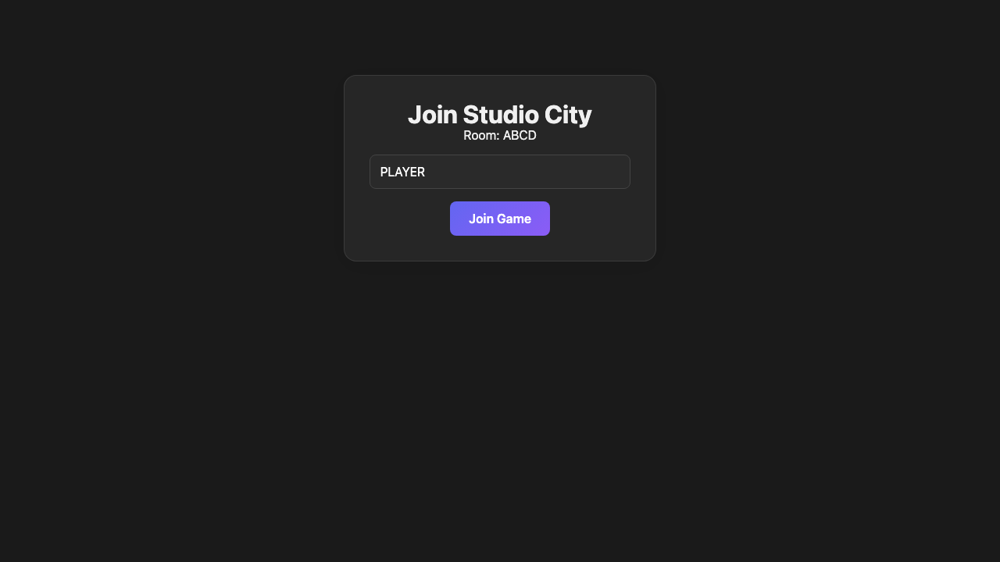
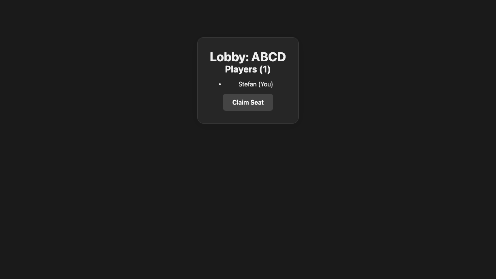

# Room Listener

The room route listens to Firestore emulator actions and renders derived Redux state.

## Room route is ready

### Verifications

- [x] Room code is visible in the join panel

## Joined player is derived from replayed actions

### Verifications

- [x] Lobby shows the player count
- [x] Joined player appears in the room

