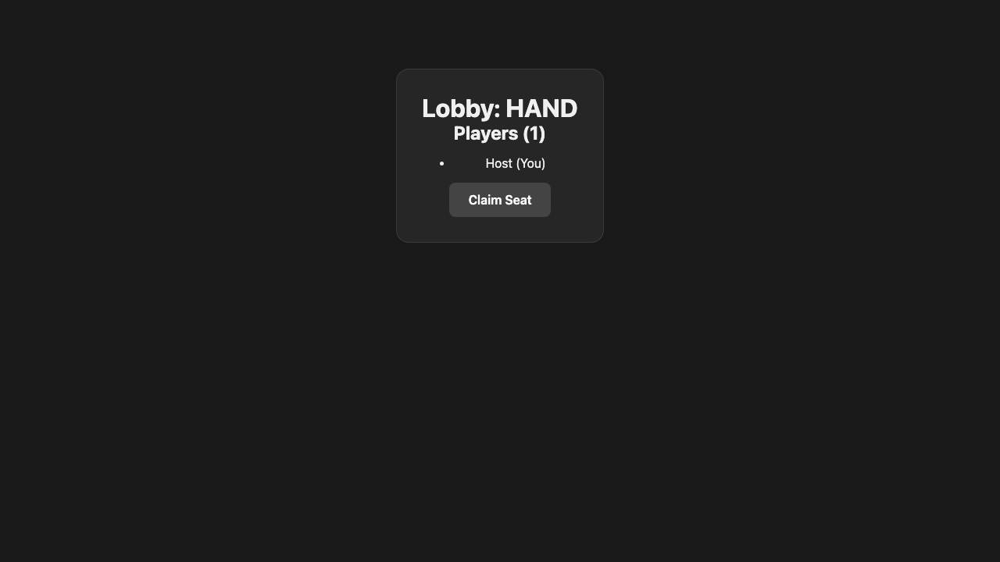
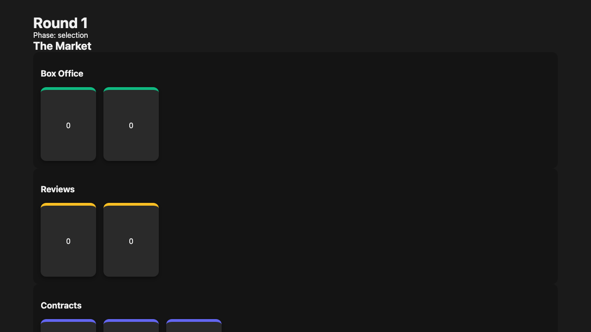
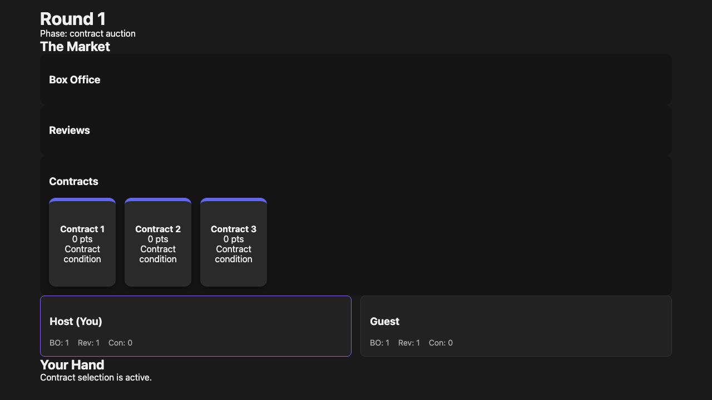
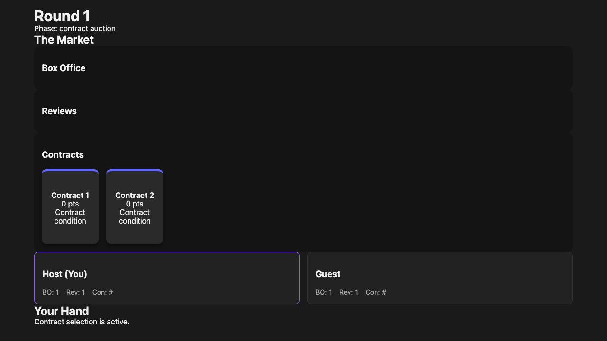

# Start Game Hand

Starting a game deals a private hand and renders real Studio City movie cards for the local player.

## Host creates a room

### Verifications

- [x] The host lobby is visible

## Started game shows the host hand

### Verifications

- [x] The local player sees six dealt movie cards
- [x] Every dealt card title comes from the real card export

## Submitted movies advance the game to contract selection

### Verifications

- [x] The round advances to the contract auction phase
- [x] Both players received box office and review cards

## Current contract picker claims a contract

### Verifications

- [x] A player receives the selected contract
- [x] The remaining contract choices stay available for the next picker

